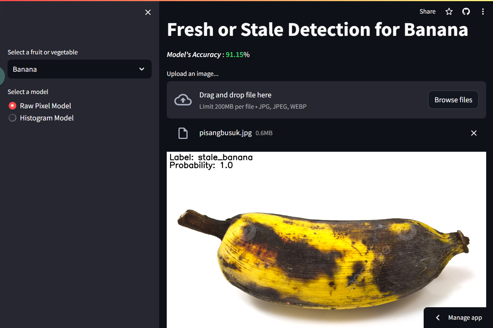

# Fresh or Stale Detection

This repository contains a Fresh or Stale Detection application that uses the K-Nearest Neighbors (KNN) algorithm to classify fruits and vegetables. The application can identify the freshness of the following items:

- Apple
- Banana
- Bitter Gourd
- Capsicum
- Orange
- Tomato

The model is trained using the dataset available at [Kaggle - Fresh and Stale Images of Fruits and Vegetables](https://www.kaggle.com/datasets/raghavrpotdar/fresh-and-stale-images-of-fruits-and-vegetables).

## Screenshot



## Demo

You can access the live demo of the application [here](https://fresh-or-stale.streamlit.app/).

## How to Run Locally

To run the application locally, follow these steps:

1. Clone the repository:

   ```bash
   git clone https://github.com/bimarakajati/Fresh-or-Stale-Detection.git
   ```

2. Install the required dependencies:

   ```bash
   cd Fresh-or-Stale-Detection
   pip install -r requirements.txt
   ```

3. Run the Streamlit app:

   ```bash
   streamlit run app.py
   ```

4. Open your web browser and go to [http://localhost:8501](http://localhost:8501).

## Note

Make sure you have Python and pip installed on your machine before running the application locally.

The dataset used for training the model is available on Kaggle: [Fresh and Stale Images of Fruits and Vegetables](https://www.kaggle.com/datasets/raghavrpotdar/fresh-and-stale-images-of-fruits-and-vegetables). You can explore and download the dataset from Kaggle.

Feel free to explore the code and experiment with different images to see how the model classifies the freshness of fruits and vegetables!